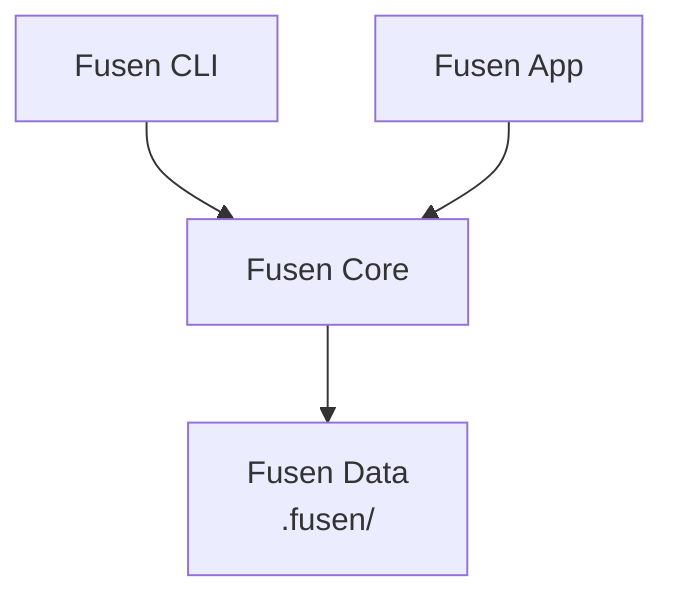

# Architecture

This document describes how Fusen is organized: its components, directory structure, and tech stack.

## Contents

- [1. Components](#1-components)
- [2. Directory structure](#2-directory-structure)
- [3. Tech stack](#3-tech-stack)
  - [3.1 Core and CLI (Rust)](#31-core-and-cli-rust)
  - [3.2 Desktop app (Tauri)](#32-desktop-app-tauri)
  - [3.3 UI (TypeScript)](#33-ui-typescript)
  - [3.4 Development tools](#34-development-tools)

## 1. Components

Fusen consists of two executables: the `fusen` command (CLI) and the desktop app (Fusen.app). Both use a shared library, `fusen-core`.



| Component | Role |
|---|---|
| `fusen-core` | Reads and writes fusen files ([Fusen Review Format v1](fusen-format/v1.md)) and the settings file ([Fusen Config Format v1](config-format/v1.md)), generates prompts, computes `docHash`, and finds Markdown files. All logic shared by the CLI and the app lives here. |
| `fusen` (`apps/cli`) | The `fusen` command ([command reference](cli.md)). `fusen <path>` launches Fusen.app with `--root <dir> --path <path>` and exits; if Fusen.app is already running, `tauri-plugin-single-instance` passes the arguments to it. The app is looked up in `$FUSEN_APP`, then `/Applications` and `~/Applications`. All other commands run without Fusen.app. |
| Tauri app | The Rust side of Fusen.app. Exposes `fusen-core` to the UI as Tauri commands, and notifies the UI of file changes through events. |
| UI | The screens of Fusen.app ([window reference](gui.md)): the Markdown view, fusen, and settings. |

## 2. Directory structure

```
fusen/
├── Cargo.toml                  # Cargo workspace
├── .cargo/config.toml          # Output directory of the generated TypeScript types
├── package.json                # pnpm workspace
├── pnpm-workspace.yaml
├── crates/
│   └── fusen-core/             # Shared library
│       └── src/
│           ├── lib.rs
│           ├── error.rs        # Errors and their messages
│           ├── project.rs      # Project root, path resolution, Markdown file discovery
│           ├── config.rs       # Settings file types, reading and writing
│           ├── prompt.rs       # Prompt generation
│           └── fusen/          # Fusen files
│               ├── mod.rs      # Fusen file types, reading and writing
│               ├── yaml.rs     # Canonical YAML output
│               ├── anchor.rs   # Line ranges and locations
│               ├── id.rs       # ULID generation, shortened IDs
│               ├── hash.rs     # docHash (git blob hash)
│               └── ops.rs      # Adding, editing, closing, and replying to fusen
├── apps/
│   ├── cli/                    # The fusen command
│   │   └── src/
│   │       ├── main.rs
│   │       └── commands/       # open, config, list, show, prompt, close (also reopen), reply
│   └── desktop/                # Fusen.app
│       ├── package.json
│       ├── vite.config.ts
│       ├── index.html
│       ├── src/                # UI (React + TypeScript)
│       │   ├── main.tsx
│       │   ├── MainWindow.tsx       # Main window: file list, document, fusen
│       │   ├── components/
│       │   │   ├── ConfirmDialog.tsx  # Confirmation dialog
│       │   │   ├── FileTree/        # File list
│       │   │   ├── DocumentView/    # Preview and source views
│       │   │   ├── FusenPanel/      # Fusen list and replies
│       │   │   └── Settings/        # Settings
│       │   ├── lib/
│       │   │   ├── commands.ts      # Tauri command calls and events
│       │   │   ├── fusen.ts         # Sorting fusen and locating them in the document
│       │   │   ├── kinds.ts         # Kind colors and palette
│       │   │   ├── links.ts         # Targets of links in the preview
│       │   │   ├── markdown.ts      # remark and rehype plugins for the preview
│       │   │   ├── sourceMap.ts     # Maps selections to source line numbers
│       │   │   └── theme.ts         # Light and dark appearance
│       │   ├── dev/
│       │   │   └── mockBackend.ts   # In-memory backend for `pnpm dev` in a browser
│       │   └── bindings/            # TypeScript types generated from Rust types
│       └── src-tauri/          # Tauri app (Rust)
│           ├── Cargo.toml
│           ├── build.rs
│           ├── tauri.conf.json
│           ├── capabilities/        # Permissions of the window
│           └── src/
│               ├── main.rs
│               ├── lib.rs           # App setup, menu, single window
│               ├── session.rs       # The open project, launch arguments
│               ├── commands.rs      # Tauri commands exposed to the UI
│               └── watcher.rs       # File watching
├── docs/
│   ├── cli.md
│   ├── gui.md
│   ├── fusen-format/
│   ├── config-format/
│   └── architecture.md
└── README.md
```

## 3. Tech stack

### 3.1 Core and CLI (Rust)

| Purpose | Library |
|---|---|
| Language | Rust (stable) |
| Command-line arguments | `clap` |
| YAML (fusen files) | `serde` + `serde_norway` |
| JSON (settings file) | `serde_json` with `preserve_order`, to keep the order of kinds |
| IDs | `ulid` |
| Timestamps | `chrono` |
| Atomic file writes | `tempfile` |
| Errors | `thiserror` |
| docHash | `sha1` |
| Markdown file discovery | `ignore`, which respects `.gitignore` |
| Clipboard (`--copy`) | `arboard` |
| TypeScript type generation | `ts-rs` |

### 3.2 Desktop app (Tauri)

| Purpose | Library |
|---|---|
| App framework | Tauri v2 |
| Single window | `tauri-plugin-single-instance` |
| File watching | `notify-debouncer-mini` (`notify`) |
| Opening URLs in the browser | `tauri-plugin-opener` |

### 3.3 UI (TypeScript)

| Purpose | Library |
|---|---|
| Language | TypeScript |
| UI | React |
| Build | Vite |
| Styling | Tailwind CSS |
| Markdown preview | `react-markdown` + `remark-gfm` |
| Heading anchors | `rehype-slug`, using the same rules as GitHub |
| Code block highlighting | `rehype-highlight` |
| Mermaid diagrams | `mermaid` |
| Source view | CodeMirror 6 (read-only) |

### 3.4 Development tools

| Purpose | Tool |
|---|---|
| Rust toolchain | rustup |
| JavaScript package manager | pnpm |
| Tauri CLI | `@tauri-apps/cli` (a devDependency of `apps/desktop`) |
